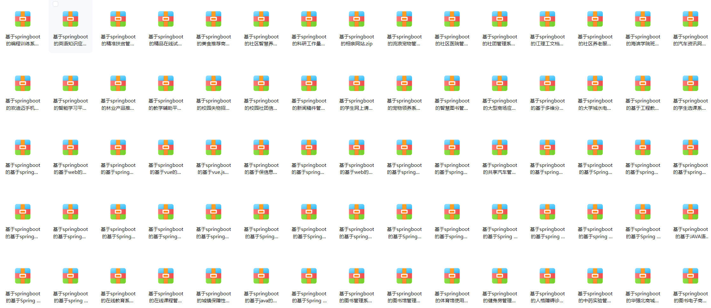

# springboot_all_projects
**SpringBoot项目合集**，所有项目都基于：**SpringBoot+vue+msyql+js+html+redis**

包括：**源码、论文、任务书、PPT**

 [https://pan.baidu.com/s/1T8h7nIRU51Je40dU25R0AQ?pwd=jmha](https://pan.baidu.com/s/1T8h7nIRU51Je40dU25R0AQ?pwd=jmha)    提取码：jmha

### 项目预览：

## 以下为项目合集：

中小企业人事管理系统代码

中药实验管理系统设计与实现

人口老龄化社区服务与管理平台

人格障碍诊断系统

企业oa管理系统

企业级工位管理系统

体育馆使用预约平台的设计与实现

作业管理系统

健身房管理系统

公司日常考勤系统

公寓报修管理系统

共享汽车管理系统

华强北商城二手手机管理系统

图书电子商务网站的设计与实现

图书管理系统

图书馆管理系统

在线教育系统

在线课程管理系统

城镇保障性住房管理系统

在线问卷调查系统的设计与实现

JAVA语言的在线考试与学习交流网页平台

技术的卓越导师双选系统设计与实现

智能无人仓库管理

医院挂号就诊系统

可盈保险合同管理系统的设计与实现

校园商铺管理系统

纺织品企业财务管理系统

装饰工程管理系统

常规应急物资管理系统

技术的实验室管理系统

框架开发的景区民宿预约系统的设计与实现

框架的工作流程管理系统的设计与实现

框架的网上商城系统的设计与实现

电商平台的设计与实现

乐享田园系统

二手车交易系统的设计与实现

企业资产管理系统

体育馆管理系统的设计与实现

公交线路查询系统

医院后台管理系统的设计与实现

医院资源管理系统

厨艺交流平台的设计与实现代码

校园网上店铺的设计与实现

学生干部管理系统

线上辅导班系统的开发与设计

网上服装商城

贸易行业crm系统

客户关系管理系统(crm)的设计与实现

工厂车间管理系统的设计

人力资源管理系统的设计与实现

音乐网站

保信息学科平台系统设计与实现

多维分类的知识管理系统

工程教育认证的计算机课程管理平台

大型商场应急预案管理系统

大学城水电管理系统

学生网上请假系统设计与实现

学生选课系统

宠物领养系统的设计与实现

教学辅助平台

新闻稿件管理系统

智慧图书管理系统设计与实现

智能学习平台系统

林业产品推荐系统

校园失物招领系统

校园社团信息管理

欢迪迈手机商城设计与开发

江理工文档管理系统的设计与实现

汽车资讯网站

流浪宠物管理系统的设计与实现

海滨学院班级回忆录的设计与实现

相亲网站

社区养老服务平台的设计与实现

社区医院管理系统

社区智慧养老监护管理平台设计与实现

社团管理系统

科研工作量管理系统的设计与实现

精准扶贫管理系统

精品在线试题库系统

编程训练系统设计与实现

美食推荐商城的设计与实现

英语知识应用网站的设计与实现